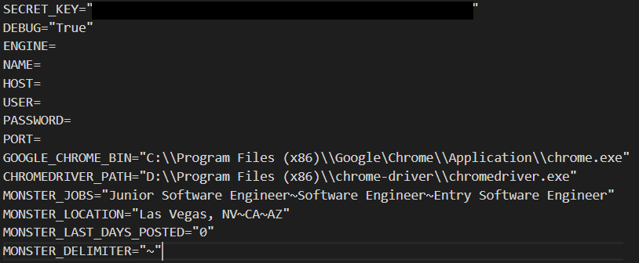
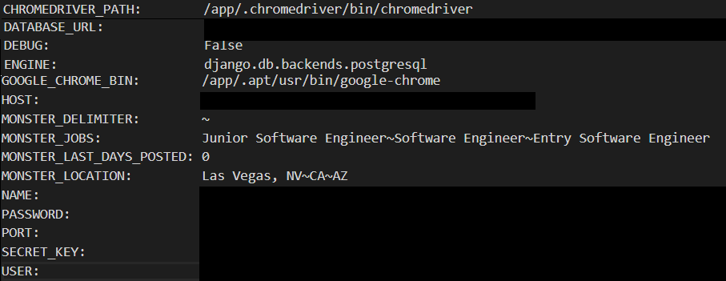

# job-finder

<h2>Introduction</h2>

This is designed to reduce time to reduce time browsing through job board sites (Monster, Indeed, etc).

Combined with Selenium (webscraping) and Heroku Scheduler (batch operation), this will receive data daily from job board sites and display it on web UI, which contains multiple filter options:
* Job title
* Job location
* Job description
* Company name

<h2>Disclaimer</h2>

This project is not intended to replace existing job boards by any means. This is only intended to streamline job search time for personal purposes by adding additional filters. 

To respect the job board sites, webscraping process has purposeful delays between requests, and this project will be used only for personal uses.

<h2>Local Setup</h2>

To execute this project, you must do the following:
1. git clone to your installation directory.
2. pip install necessary imports in [requirements.txt](requirements.txt)
3. Install [Google Chrome](https://www.google.com/chrome/) and [ChromeDriver](https://chromedriver.chromium.org/downloads)
4. Create .env file at the project root and add the following in the file:  Change SECRET_KEY, GOOGLE_CHROME_BIN, CHROMEDRIVER_PATH to your needs. SECRET_KEY can be randomly generated. Others are optional to execute as your preferences. 
5. Migrate schema in local. If you followed the config given above, then it will create a sqlite database in your root directory. 
```
heroku local:run python manage.py makemigrations
heroku local:run python manage.py migrate
```
6. Try running webscraping. Warning: This process will take an hour or more.
```
heroku local:run python manage.py job_scrape
```
7. Try running the server to view the UI.
```
heroku local:run python manage.py runserver
```
8. Optional: Create admin to access your django admin db page. [Link to the django admin tutorial.](https://developer.mozilla.org/en-US/docs/Learn/Server-side/Django/Admin_site)
```
heroku local:run python manage.py createsuperuser
```
When you are done with 1-6 steps, you should have these following files/directories in your root directory:


<h2>Heroku Setup</h2>

1. Create a Heroku account.
2. Install [Heroku CLI](https://devcenter.heroku.com/articles/getting-started-with-python#set-up)
3. Create Heroku repository and deploy this code.
```
heroku create
git push heroku master
```
4. Go to your Heroku dashboard site (`https://dashboard.heroku.com/apps/<heroku repository name>`).
5. Go to Settings -> Buildpacks and add the following buildpacks: 
6. Go to Overview and get these installed addons:

7. Go to Settings -> Config Vars to add the following config pairs:  Change SECRET_KEY to the generated key created in local. Also, change HOST, NAME, PASSWORD, PORT, AND USER mentioned in your Heroku Postegre addon. Don't change GOOGLE_CHRONE_BIN and CHROMEDRIVER_PATH unless they are causing an issue.
8. Go back to your local terminal and setup Django for heroku server.
```
heroku run python manage.py makemigrations
heroku run python manage.py migrate
```
9. Schedule batch job by using Heroku Scheduler  Note: You can directly run scraping job by running this command in your local terminal:
```
heroku run python manage.py job_scrape
```